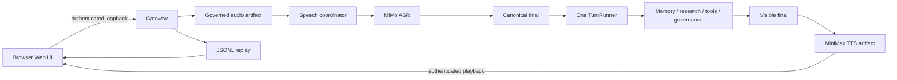
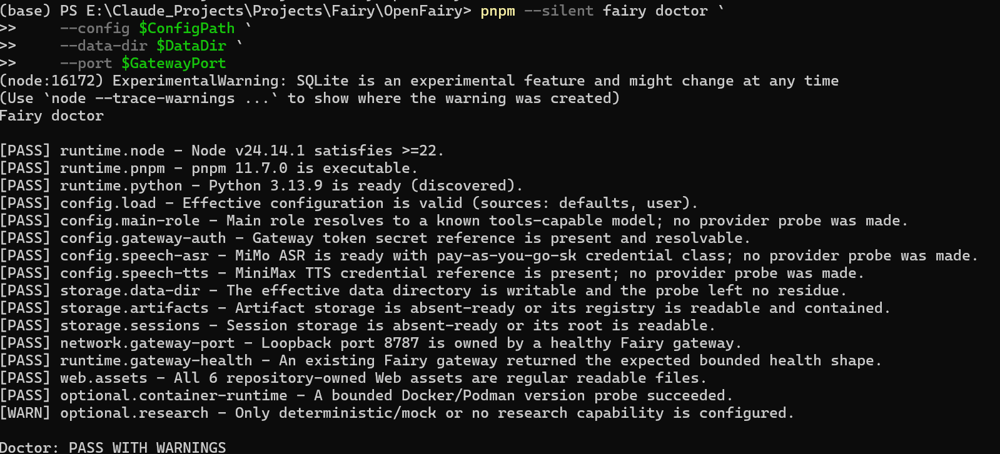
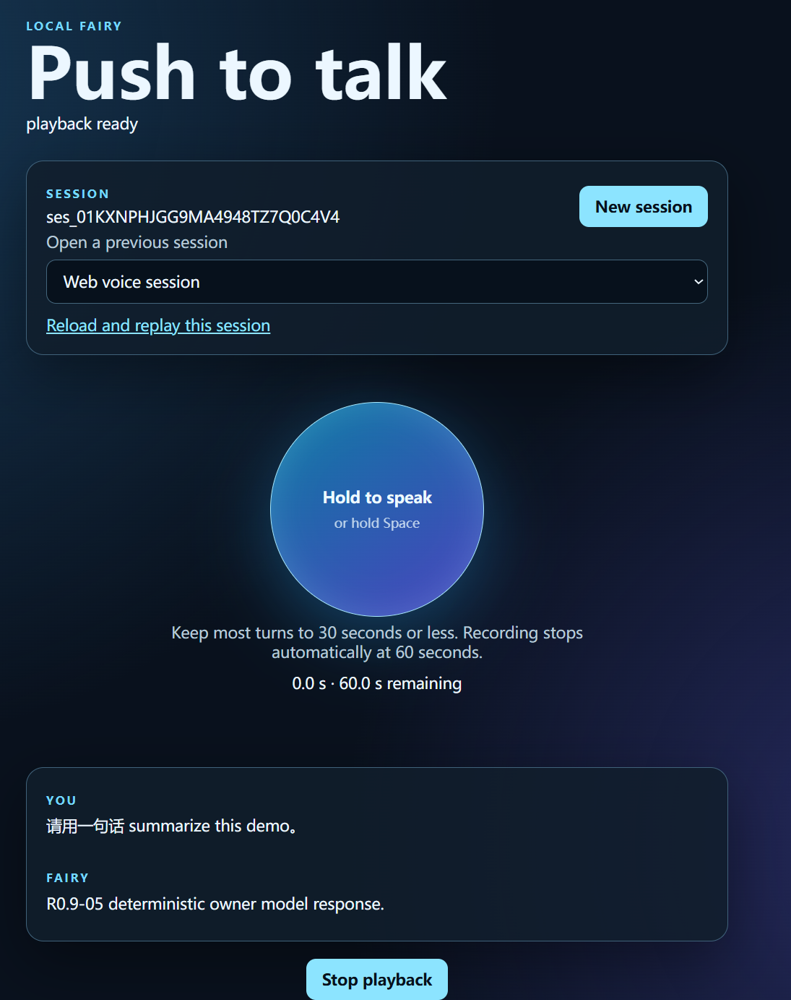
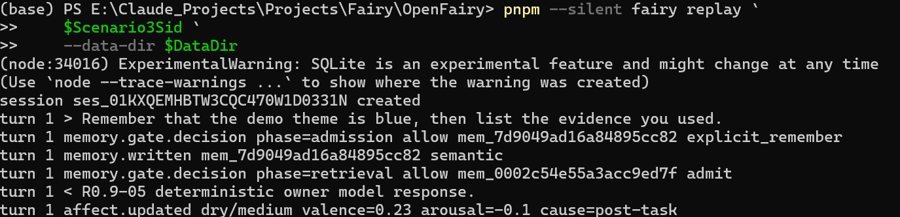

# OpenFairy

## Project positioning

OpenFairy is a local-first, model-agnostic AI companion runtime. Its gateway unifies governed model routing, tools, memory, research, replay, and a browser push-to-talk surface while keeping canonical history in append-only JSONL.

## Current status: OpenFairy v0.9 Developer Preview

This repository is an interviewable developer preview, not a production-ready desktop product. R0.9-02 closed with the voice session ledger at **3/20**; the current committed ledger is **4/20**, so S4 remains incomplete. R0.9-03+04 bounded workflows and Morning Briefing are deferred; M3-06 faster-whisper local ASR is gated but deferred to full M3/v1.0.

The [canonical v0.9 tiered plan](docs/v0.9/OpenFairy-v0.9-final-tiered-plan.md) is the single current plan authority. The [v0.9 deferral ledger](docs/v0.9-deferrals.md) records binding named landing gates, expiry conditions, and explicit waiver rules for capabilities outside this preview; it does not authorize their implementation.

## What is implemented

- One authenticated loopback gateway and one TurnRunner path.
- OpenAI-compatible text models with clearance-aware routing and tools.
- Local artifacts, memory gates, research snapshots/citations, JSONL replay, and audit evidence.
- Non-streaming artifact-backed MiMo ASR and MiniMax TTS through supervised Python workers.
- Browser push-to-talk for WAV capture, transcript/final rendering, MP3 playback, and replay.
- Source-first CLI commands including `doctor`, `dev`, voice import/ASR, replay, memory, and research inspection.

## What is explicitly deferred

There is no installer, service, tray app, remote/LAN listener, streaming voice, VAD/endpointing, barge-in, local ASR, autonomous scheduler/workflow runtime, or production subagent runtime. Local playback **Stop** only stops playback in the browser; it is not barge-in.

## Architecture overview



The gateway is the sole session owner. Browser state is a projection, provider workers remain behind the gateway boundary, and raw/base64 audio never enters canonical JSONL.

## Prerequisites

- Windows 11 and PowerShell 7 are the primary developer-preview path.
- Node.js 22 or newer.
- pnpm 11.7.0 (the repository pins it through `packageManager`).
- Python 3.11 or newer on the normal `python3`, `python`, then Windows `py -3` discovery path.
- A generic OpenAI-compatible model, ordinary MiMo pay-as-you-go key, and MiniMax T2A v2 credential for the live voice scenario.
- Docker or Podman is optional; doctor reports a warning when neither is present.

## Quick start

From Windows PowerShell:

```powershell
pnpm install
New-Item -ItemType Directory -Force "$env:APPDATA\fairy" | Out-Null
Copy-Item examples/fairy.v0.9.yaml "$env:APPDATA\fairy\fairy.yaml"
notepad "$env:APPDATA\fairy\fairy.yaml"

# Use process-scoped values for this shell; do not commit or paste them into YAML.
$env:MAIN_MODEL_API_KEY = '<set locally>'
$env:GATEWAY_TOKEN = '<set locally>'
$env:MIMO_ASR_PAYGO = '<set locally>'
$env:MINIMAX_T2A_TOKEN = '<set locally>'

pnpm fairy doctor

# Explicit process-scoped owner consent for real speech-provider execution.
$env:FAIRY_OWNER_LIVE_ASR = '1'
$env:FAIRY_OWNER_LIVE_TTS = '1'

pnpm fairy dev

# After Ctrl+C, remove the consent flags from this shell.
Remove-Item Env:FAIRY_OWNER_LIVE_ASR -ErrorAction SilentlyContinue
Remove-Item Env:FAIRY_OWNER_LIVE_TTS -ErrorAction SilentlyContinue
```

The example model URL and model name are intentionally unusable placeholders. Replace them with the OpenAI-compatible service you control. Do not replace the closed MiMo/MiniMax endpoint profiles with URLs.

Doctor remains provider-zero. The two owner-live flags are explicit process-scoped owner consent for real speech-provider execution. Setting the flags alone makes no provider request; a request occurs only after a valid governed voice submission. Do not store these flags in YAML or any committed configuration.

## Configuration and secret references

On Windows, the default user configuration is `%APPDATA%\fairy\fairy.yaml`; local data defaults to `%LOCALAPPDATA%\fairy`. Effective precedence is repository defaults, the explicit `--config`/`FAIRY_CONFIG` file or user file, `fairy.workspace.yaml`, then code-owned session overrides.

Configuration stores references such as `secret://gateway_token`, never values. A reference name resolves from its exact name, normalized uppercase name, or `FAIRY_SECRET_`-prefixed normalized name. Keep values process-local or in your normal secret manager and never commit them.

## Doctor

```powershell
pnpm fairy doctor
pnpm fairy doctor --json
pnpm fairy doctor --config .\path\to\fairy.yaml --data-dir .\.fairy-data --port 8787
```

Doctor validates runtime floors, effective configuration, credential presence/class, storage roots, loopback ownership, gateway health, exact Web assets, and optional capabilities. It never probes a model, MiMo, MiniMax, or research provider. JSON mode emits one machine-readable object; warnings do not fail the command.

## One-command dev start

For a real speech-provider voice turn, first run doctor, then set the two process-scoped owner-consent flags shown in Quick start before launching dev. Setting them does not itself contact a provider.

```powershell
pnpm fairy dev
# or keep browser launch manual
pnpm fairy dev --no-open
```

If the port is free, dev owns a source-first gateway child. If a healthy Fairy gateway already owns it, dev reuses that process and never kills it. Any non-Fairy or unhealthy occupant fails before gateway or browser spawn. The printed browser URL is always `http://127.0.0.1:<port>/web/` and never contains the gateway token. Press Ctrl+C to stop the launcher; only an owned gateway is stopped.

## Web voice walkthrough

1. Run doctor, explicitly activate process-scoped owner consent with `FAIRY_OWNER_LIVE_ASR` and `FAIRY_OWNER_LIVE_TTS`, then run dev.
2. Enter the configured gateway token in the Web UI. It is held in memory only.
3. Hold Record, speak a short non-sensitive bilingual phrase, release, and submit.
4. Confirm the final transcript, visible answer, and MP3 playback. If autoplay is blocked, press Play.
5. **Stop** is local-only playback control, not barge-in.
6. Reload the session link to render canonical replay.

This walkthrough demonstrates the implemented path; it does not claim ASR accuracy benchmarking. A non-empty but imperfect transcript is acceptable for the preview.

## Three demo scenarios

- [Normal bilingual voice round trip](docs/demo/scenarios/01-normal-voice.md)
- [Synthetic secret route denial](docs/demo/scenarios/02-secret-route-denial.md)
- [Memory/research/replay evidence](docs/demo/scenarios/03-memory-research-replay.md)

Run Scenario 2 from a clean shell. If Scenario 1 enabled real speech providers, stop that dev launcher, clear both owner-live flags with the cleanup commands above, and restart dev from the clean shell before running the synthetic denial procedure.

Use the [three-minute script](docs/demo/v0.9-demo-script.md) and [interview summary](docs/demo/interview-project-summary.md). The completed countersigned owner screenshots are:





## Security / threat-model summary

- Gateway and Web bind to loopback only; WebSocket and HTTP actions require the configured token.
- Tokens and provider credentials are never placed in browser URLs, doctor output, CLI evidence, NDJSON, or JSONL.
- Labels and provider clearance are checked before speech staging, worker spawn, or provider I/O.
- Provider workers use repository-owned closed endpoint profiles, disable proxies/redirects, and keep audio at the file/HTTP boundary.
- Browser artifacts are session-owned; replay and diagnostics use bounded redaction.

## Replay and evidence

```powershell
pnpm fairy sessions
pnpm fairy replay <session-id>
pnpm fairy replay <session-id> --json
pnpm fairy research sources --json
pnpm fairy research citations --json
```

Canonical JSONL is the evidence source. Do not commit live session logs, audio, registry state, tokens, provider bodies, or owner data.

## Troubleshooting

| Symptom | Safe action |
|---|---|
| Node too old | Install Node 22+ and rerun doctor. |
| pnpm missing | Enable Corepack/install the pinned pnpm version. |
| Python below 3.11 | Put Python 3.11+ on the normal discovery path; do not add a YAML interpreter path. |
| Config parse failure | Fix the bounded paths doctor reports; validate `examples/fairy.v0.9.yaml`. |
| Unresolved secret reference | Set the referenced environment variable in the current shell without printing it. |
| MiMo credential class mismatch | Use an ordinary pay-as-you-go `sk-*` key, not a Token Plan credential. |
| MiniMax resource unavailable | Verify account resource/voice availability; do not change the closed endpoint profile. |
| Port occupied | Stop the unrelated process or choose another loopback `--port`. |
| Gateway already running | `Gateway: REUSED` is expected; exiting dev leaves it alive. |
| Microphone permission denied | Grant the browser site microphone permission and retry a non-sensitive phrase. |
| Browser autoplay blocked | Press Play; do not weaken browser security. |
| ASR imperfect but non-empty | Continue the demo and describe it honestly; accuracy is not benchmarked here. |
| Docker warning | Ignore it for the Tier-1 voice demo; optional execution tools remain unavailable. |
| Where files live | Config: `%APPDATA%\fairy`; data: `%LOCALAPPDATA%\fairy`, unless explicitly overridden. |
| Stop/cleanup | Press Ctrl+C in the dev terminal; verify the selected port is free before restarting. |

## Technology stack

TypeScript, Node.js, pnpm workspaces, tsx source-first execution, Vitest, JSON Schema/Ajv, WebSocket, browser Web Audio, stdlib-only Python speech workers, append-only JSONL, and GitHub Actions on Ubuntu/Windows with Python 3.11 floor lanes.

## Interview / portfolio summary

OpenFairy demonstrates that a voice-enabled assistant can be assembled around explicit trust boundaries rather than a single vendor SDK: one governed gateway, content-derived labels, zero-byte provider denial, canonical replay, source-first developer tooling, and deterministic cross-platform tests. See the [bounded interview pitches](docs/demo/interview-project-summary.md).

## Document map

| Document | Purpose |
|---|---|
| [Product requirements](docs/PRD.md) | Product intent and non-functional requirements |
| [Architecture](docs/ARCHITECTURE.md) | System views and responsibility boundaries |
| [Roadmap](docs/ROADMAP.md) | Milestones and gates |
| [Canonical v0.9 tiered plan](docs/v0.9/OpenFairy-v0.9-final-tiered-plan.md) | Current release plan and consolidated 60-second PTT contract |
| [v0.9 deferral ledger](docs/v0.9-deferrals.md) | Binding stable-ID carry-ins, landing gates, and accepted deviations |
| [Decisions](docs/DECISIONS.md) | Architecture decision records |
| [Data governance](docs/specs/data-governance.md) | Labels, residency, routing, and egress |
| [Voice pipeline](docs/specs/voice-pipeline.md) | Voice design and deferred full-M3 targets |
| [Protocol](docs/specs/protocol.md) | Canonical event and transport contracts |
| [Evaluations](docs/specs/evals.md) | Registered deterministic suites and future benches |
| [Reviewer handbook](REVIEWER-HANDBOOK.md) | Gate and evidence discipline |
