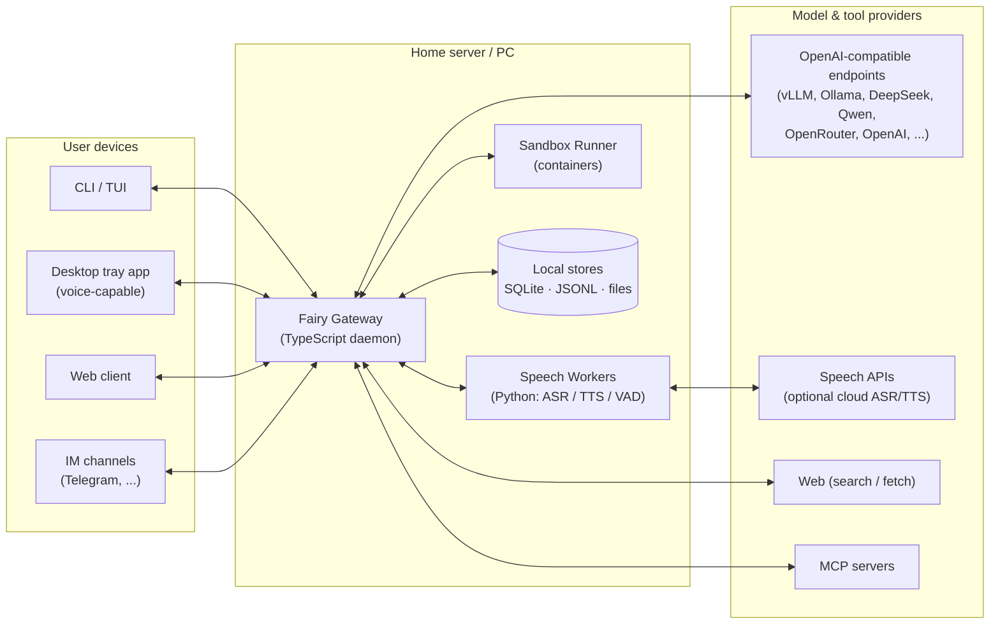
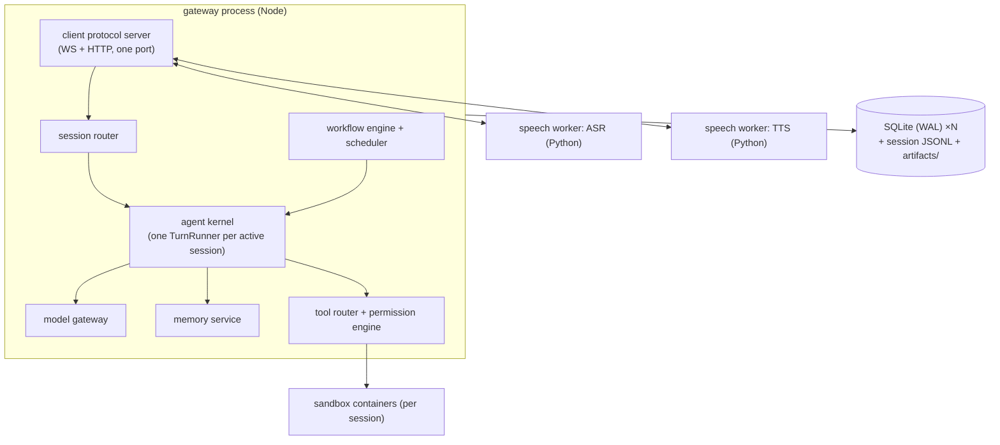
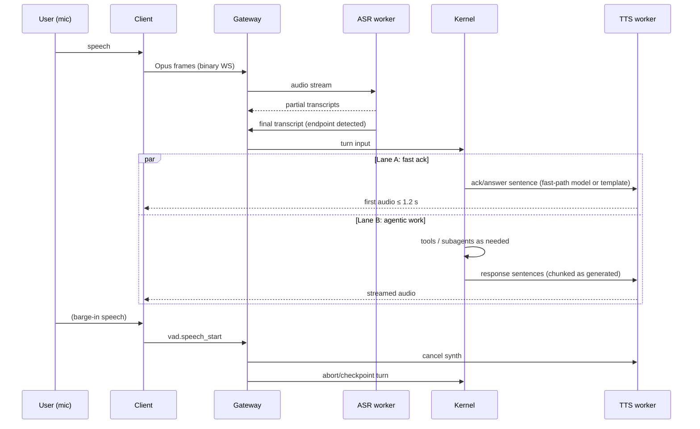

# Fairy — Technical Architecture

| | |
|---|---|
| Status | Draft v0.1 |
| Date | 2026-07-02 |
| Related | [PRD.md](PRD.md) · [DECISIONS.md](DECISIONS.md) · subsystem specs in [specs/](specs/) |

This document is the system-level view. Each major subsystem has a deep-dive spec in `docs/specs/`; this file defines the boundaries between them, the protocols that connect them, and the concerns that cut across them.

## 1. Architectural principles

1. **OpenAI-format first, vendor-neutral always** (FR-12). One gateway owns all model I/O; the rest of the system sees only normalized events. No package outside `model-gateway` may import a vendor SDK.
2. **The gateway is the product** (FR-14). A resident daemon owns sessions, memory, scheduling, and tool execution. Clients are thin renderers of an event stream. Platform differences live in entry points and adapters, never in the kernel (Hermes-style).
3. **Events are the source of truth** (FR-1, FR-15). Every session is an append-only event log. UIs render it, replay reconstructs it, tests assert on it, the debugger scrubs through it.
4. **Context is the scarcest resource** (FR-10). Every token entering the prompt is budgeted by zone; reduction is a staged ladder, not a panic; large data lives in files, referenced by path (Manus lesson).
5. **Capability degradation over capability assumption** (FR-12, FR-12a). The system asks the registry what a model can do and compensates: prompted tool-calling, perception service, schema-validate-repair for JSON.
6. **Registries, not imports** (NFR-8). Providers, tools, skills, channels, personas, workflows, hooks all register against stable interfaces. Adding one touches zero core files.
7. **Security by default** (FR-6, FR-15). Execution is sandboxed unless explicitly trusted; content carries provenance; secrets are injected at the edge, never through model context.
8. **Two-lane responsiveness** (FR-2). A fast conversational lane keeps voice alive while the agentic lane does real work.
9. **Crash-only software** (NFR-3). Every long-lived process can be killed at any time; durable state is checkpointed; startup is recovery.
10. **Boring technology.** SQLite, JSONL, WebSocket, Markdown, YAML. Novelty budget is spent on the agent design, not the plumbing.

## 2. System context



## 3. Container view

| Container | Runtime | Responsibility | Spec |
|---|---|---|---|
| **Gateway daemon** | Node/TypeScript | Client protocol server, session router, channel adapters, auth, scheduler, workflow engine | this doc, [orchestration](specs/orchestration.md) |
| **Agent kernel** | TS library inside gateway | Turn loop, context engine, tool router, orchestrator (subagents/plan/loop), affect engine | [context-engine](specs/context-engine.md), [orchestration](specs/orchestration.md), [persona-affect](specs/persona-affect.md) |
| **Model gateway** | TS library inside gateway | Provider transports, model registry, role router, normalization, perception service | [model-gateway](specs/model-gateway.md) |
| **Memory service** | TS library inside gateway | Working blocks, episodic/semantic/procedural stores, MemoryGate admission, Chronicle, retrieval, consolidation jobs | [memory](specs/memory.md) |
| **Research orchestrator** | TS library inside gateway | Query planning, zh/en fan-out, dedup, source grading, snapshot cache, citation ledger | [research](specs/research.md) |
| **Speech workers** | Python processes | Streaming ASR, TTS, VAD; local models or cloud API adapters; binary audio protocol to gateway | [voice-pipeline](specs/voice-pipeline.md) |
| **Sandbox runner** | Docker/Podman containers | Isolated shell/code execution with resource + network policy | [sandbox-security](specs/sandbox-security.md) |
| **Clients** | varies | Render event stream, capture input/audio; no business logic | protocol §7 |

The kernel and its sibling libraries run **in-process** with the gateway daemon in v1 (single box, minimal latency). The package boundaries are strict enough that any library can later be moved behind the wire protocol without changing callers (see §9).

## 4. Runtime topology

Default single-box deployment; speech workers may run on a separate GPU machine.



Process model: the gateway is a supervisor. Speech workers and sandbox containers are child/managed processes with health checks, warm restart, and backpressure. One logical **TurnRunner** per active session serializes that session's turns; sessions run concurrently up to a configured limit.

## 5. The turn pipelines

### 5.1 Text turn (FR-1)

```
client → session.input event
  → context engine assembles prompt (zones: system/persona · memory digest · skills index
      · task state · history · new input)                                  [specs/context-engine]
  → model gateway streams normalized deltas (text | tool_call | reasoning) [specs/model-gateway]
  → tool calls → tool router → permission engine → execute (sandbox/web/mcp/memory/...)
      → tool results appended, loop until final                            [specs/sandbox-security]
  → memory ingest tap (async, off the hot path)                            [specs/memory]
  → affect appraisal tap (async)                                           [specs/persona-affect]
  → events fan out to all attached clients; everything appended to session log
```

### 5.2 Voice turn (FR-2) — two-lane design



Lane A answers directly when the query is conversational (no tools needed) — a router classifies this from the partial transcript before the final endpoint, pre-warming the main model. When Lane B engages, Lane A speaks a persona-appropriate acknowledgment and Lane B streams progress narration events that may be voiced ("Found two of the three papers…"). Full latency budget: [specs/voice-pipeline.md](specs/voice-pipeline.md).

### 5.3 Subagent / plan / loop turns

Orchestrated flows reuse the same TurnRunner recursively with isolated contexts and structured returns. Plan mode wraps the runner in a read-only tool policy; Loop mode runs the runner in fresh-context iterations with file-based state. Details: [specs/orchestration.md](specs/orchestration.md).

## 6. Event model & session storage

Every observable fact is an **event envelope**:

```jsonc
{
  "v": 1,                         // protocol version (semver-major)
  "id": "evt_01J...",             // ULID — sortable, unique
  "sid": "ses_01J...",            // session id
  "turn": 42,                     // turn number within session
  "ts": "2026-07-02T09:30:00.123Z",
  "actor": "user | agent | tool | system | subagent:<id> | workflow:<id>",
  "type": "turn.input | turn.delta | turn.final | tool.call | tool.result
           | approval.request | approval.resolved | progress.update
           | speech.asr.partial | speech.tts.chunk | memory.written
           | citation.recorded | workflow.checkpoint | route.denied
           | affect.updated | plan.proposed | loop.iteration.* | ...",
  "provenance": "user | agent | tool:<name> | web:<domain> | mcp:<server>",
  "labels": { "sensitivity": "public|internal|personal|secret",
              "residency": "local-only|region-restricted|global-ok" },
  "payload": { }                  // type-specific; large blobs → artifact refs
}
```

The **normative registry** of event types, payload schemas, versioning rules, the approval state machine, and golden fixtures lives in [specs/protocol.md](specs/protocol.md) — the runtime event canon is Fairy's internal language; Chat Completions is only the model-boundary dialect inside the model gateway (ADR-014).

Storage per session: `sessions/<sid>/log.jsonl` (append-only, fsynced on turn boundaries) + periodic `snapshot.json` (materialized state: context zones, task list, affect, token ledger) so resume cost is O(tail), not O(history). Artifacts live in `sessions/<sid>/artifacts/` and are referenced by relative path + content hash. Blobs never go into the log.

Consequences: any client renders any session live or historical from the same stream; the replay debugger and regression tests run offline on logs; compaction is itself an event, so pre-compaction history remains inspectable.

## 7. Client protocol (gateway ⇄ clients)

Single port. `HTTP` for auth, session CRUD (`GET /sessions` since M1-01), artifact download, health. `WebSocket` for the event stream: client subscribes to sessions, receives envelopes, sends input events. Session resume (M1-01): on boot the gateway rebuilds session state from logs and appends a synthetic `turn.interrupted(gateway_restart)` to any turn left open — the log never lies about a half-happened turn. Binary WS frames (with a 4-byte channel prefix) carry audio to avoid base64 overhead. Protocol is versioned (`v` field + `GET /meta`); gateway maintains one minor version of backward compatibility (NFR-9).

Channel adapters (Telegram, etc.) are internal clients: they log in with a channel identity and translate between platform messages and protocol events. Channel identity carries a **trust level** consumed by the permission engine (FR-15).

## 8. Data architecture

| Store | Tech | Contents |
|---|---|---|
| Session logs | JSONL + snapshots | Event streams (source of truth) |
| Core DB | SQLite (WAL) | Session index, config overlays, schedules, workflow checkpoints, permission grants, audit log, cost ledger |
| Memory DB | SQLite + FTS5 + sqlite-vec | Semantic facts, episodic summaries, embeddings, provenance |
| Artifacts | Filesystem | Files produced/consumed by turns; content-hash-addressed cache for perception outputs |
| Secrets | OS keychain / age-encrypted file | Provider keys, channel tokens — read only by edge adapters |
| Config | Layered files | `defaults → user (fairy.yaml) → workspace → session overrides`; env expansion; hot-reload where safe |

Retention: session logs and memory are permanent until user-deleted (FR-4 controls); audit log append-only; ledger rows immutable. Everything exportable — it's already open formats on disk (NFR-4).

## 9. Package layout (monorepo)

```
fairy/
├── packages/
│   ├── protocol/          # event envelope, client protocol types, versioning (no workspace deps; ajv + ulid only)
│   ├── config/            # layered config loader + schema validation (defaults → user → workspace → session)
│   ├── kernel/            # turn runner, context engine, tool router, affect engine
│   ├── model-gateway/     # transports, registry, role router, normalization, perception
│   ├── memory/            # stores, MemoryGate, Chronicle, retrieval, consolidation jobs
│   ├── research/          # query planning, fan-out, grading, snapshots, citation ledger
│   ├── orchestrator/      # subagents, plan mode, loop mode, workflow engine
│   ├── tools-std/         # built-in tools: fs, shell(sandbox), web.search/fetch, vision.*, memory.*
│   ├── channels/          # channel adapter SDK + built-ins (telegram, ...)
│   └── testing/           # replay harness, provider conformance kit, latency bench
├── apps/
│   ├── gateway/           # the daemon (composition root; the only place wiring happens)
│   ├── cli/               # terminal client
│   └── desktop/           # tray app (voice) — later milestone
├── workers/
│   └── speech/            # Python: asr/, tts/, vad/, shared duplex-protocol lib
├── extensions/            # user-land: agents/, skills/, personas/, workflows/, hooks/, mcp.d/
└── docs/
```

Dependency rule (enforced in CI): `protocol` ← everything; `kernel` may not import `channels`/`apps`; vendor SDKs only inside `model-gateway` transports and speech worker adapters. Interfaces + registries at every seam (NFR-8).

## 10. Cross-cutting concerns

**Configuration.** Single schema, layered overlays (§8), validated at boot with actionable errors. Discovery (normative since M0-02): explicit `--config` / `FAIRY_CONFIG` → user file (`%APPDATA%\fairy\fairy.yaml` on Windows; `$XDG_CONFIG_HOME/fairy/fairy.yaml` else `~/.config/fairy/fairy.yaml` elsewhere) → `fairy.workspace.yaml` walking up from cwd (stopping at repo root) → built-in defaults; merge order stays defaults → user → workspace → session. Data dir: `gateway.data_dir`, defaulting to `%LOCALAPPDATA%\fairy` / `$XDG_DATA_HOME/fairy`. Platform-parameterized path helpers must use `path.win32`/`path.posix` explicitly, never the ambient joiner. Every subsystem documents its keys in its spec. Keys as of M1-02: `kernel.system_prompt`, `kernel.max_tool_iterations` (16), `gateway.watchdog_s` (60), `workspace.root` (gateway cwd), `permissions.rules` (first-match; shipped defaults: `fs.*`-in-workspace allow · `shell.run` ask · `web.*` allow · `*` ask), `permissions.ask_timeout_s` (300), `sandbox.image`/`timeout_s`/`default_profile`, `search.engine`. Added M1-03: `context.reduce_at` (0.8), `context.output_reserve` (model `max_output`, else 4096), `context.min_recent_turns` (4); `models[].context_window` (default 128000) and `models[].max_output` accepted top-level or under `capabilities`. Model/role bindings and persona are hot-swappable at session boundaries.

**Observability (FR-15).** OpenTelemetry-compatible tracing: one trace per turn, spans for model calls, tools, speech stages (latency budget attribution built-in). Label-aware redaction: `personal+` content never enters traces (specs/data-governance §3). Token/cost ledger written per model call, aggregated per turn/session/day; budget breach emits events the scheduler acts on. `fairy doctor` diagnoses config/connectivity; the replay debugger steps through any session log — implemented since M1-03 as `fairy replay <sid> [--manifests|--turn <n>|--json]`, fully offline over `log.jsonl`, tolerant of corrupt tails from hard kills.

**Error taxonomy & resilience.** Normalized error classes: `UserError` (bad input), `ProviderError` (retryable? rate-limit? auth?), `ToolError` (surfaced to the model — errors are information, they stay in context per Manus lesson), `PolicyError` (permission denied), `Fatal`. Retries with jittered backoff at the transport layer only; circuit breaker per provider endpoint feeding router health scores; graceful degradation messages to the user, never silent failure.

**Testing (NFR-9).** Unit tests per package; **provider conformance suite** (golden streaming/tool-call fixtures per vendor) run nightly; **replay regression** — recorded sessions re-run against new builds, diffing event streams; **latency bench** for voice in CI with synthetic audio; **memory canary evals**; **security suite** (sandbox escape attempts, injection corpus, secret-egress probes).

**Versioning.** Protocol semver; session log format versioned per envelope; migrations are forward-only scripts; a session written by v1.x is always readable by v1.y (y > x).

## 11. Deployment

- **Single box (default):** one installer/`docker compose up`; gateway + speech workers + sandbox on the user's PC or home server. Windows: gateway native Node; sandbox + speech via Docker Desktop (WSL2). GPU speech workers optionally on a second machine, pointed to by config.
- **Access from outside LAN:** user-provided tunnel (Tailscale/WireGuard recommended, documented); the gateway itself never exposes an unauthenticated port; token auth on every client connection.
- **Updates:** versioned releases; config and data schemas migrate on boot; rollback = previous binary + forward-compatible data.

## 12. Extension points (summary)

| Extension | Mechanism | Trust |
|---|---|---|
| Model provider | registry entry + transport (if non-OpenAI wire) | config-declared |
| Tool | `tools-std` interface, registered at boot | permission engine policies |
| MCP server | `extensions/mcp.d/*.yaml` | per-server trust level |
| Skill | `extensions/skills/<name>/SKILL.md` (progressive disclosure) | reviewed; procedural-memory-written skills gated |
| Hook | `extensions/hooks/` scripts on lifecycle events | can veto; sandboxed by default |
| Persona | `extensions/personas/<name>/` | content-only |
| Workflow | `extensions/workflows/*.yaml` | permission engine + budgets |
| Channel | `packages/channels` adapter SDK | trust level per channel |
| Search engine | research provider registry | per-domain policies (specs/research.md) |
| Computer-use surface | **reserved ABI** (specs/computer-use.md) | strictest tier; post-v1 |

## 13. Requirements traceability

| PRD | Architecture home |
|---|---|
| FR-1 sessions | §5.1, §6 event log |
| FR-2 voice | §5.2, specs/voice-pipeline |
| FR-3 web | tools-std, specs/sandbox-security (provenance) |
| FR-3a research | specs/research |
| FR-4 memory | specs/memory (incl. MemoryGate, Chronicle) |
| FR-5 persona/affect | specs/persona-affect |
| FR-6 sandbox | specs/sandbox-security |
| FR-7/8/9 subagents/plan/loop | specs/orchestration |
| FR-10 context | specs/context-engine |
| FR-11 workflows | specs/orchestration §5 |
| FR-12/12a gateway/perception | specs/model-gateway |
| FR-13 extensibility | §12 |
| FR-14 clients | §7 |
| FR-15 trust/observability | §10, specs/sandbox-security |
| FR-15a labels/residency | specs/data-governance |
